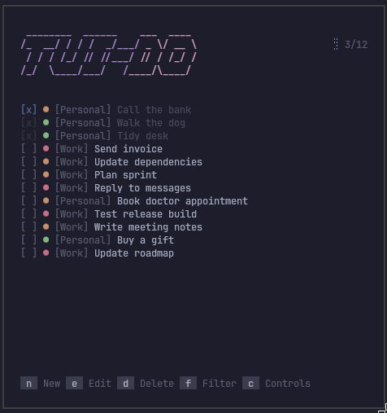
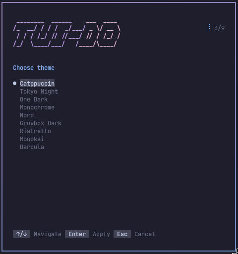

# TUI-DO

**Minimal terminal-first todo manager for tiling WM users.**

Built with Go for fast, keyboard-driven workflows — no mouse required.

**TUI** (terminal UI) + **DO** (your to-do list). The banner yells **TUIDO** in slant ASCII; you run **`tuido`** in lowercase — same tradition as `vim`, `git`, and other tools that let the work speak louder than the name.

<p align="center">
  <a href="https://go.dev/"></a>
  <a href="https://github.com/charmbracelet/bubbletea"></a>
  <a href="https://github.com/gsusgit/tuido/actions/workflows/ci.yml"></a>
  <a href="#installation"></a>
</p>

<p align="center">
  
</p>

---

## Why?

I've always liked having **one simple place** for what's pending — not a productivity suite with hundreds of toggles I'll never use. I just want to see **what I've done** and **what's still left**.

My setup is a Hyprland workspace with the essentials always on screen: music, processes, terminal… and it started to feel like **something was missing** there. Riding the Hyprland / terminal-aesthetic wave, I thought: _let's experiment_ — build something **for myself**, that lives in that same tile and stays out of the way.

That's how **TUI-DO** was born: out of a personal need first. If it fits your workflow too, welcome.

---

## Features

- ⌨️ **Keyboard-first** — navigate, create, edit, delete without leaving home row
- 📐 **Responsive TUI** — adapts layout and scroll to your terminal size
- ● **Task priorities** — high / medium / low with color-coded indicators
- 🏷️ **Categories & filters** — status, category, sort in a dedicated panel
- 🔍 **Live search** — filter the list by title with `/`
- 🌍 **Multi-language** — English, Español, Français, Deutsch, Italiano, Português
- 🎨 **Nine themes** — Catppuccin, Tokyo Night, One Dark, Monochrome, Nord, Gruvbox, Ristretto, Monokai, Darcula
- 💾 **Local-first** — JSON on disk under `~/.config/tuido/`, autosave
- 🪶 **Lightweight** — single binary, no daemon, no account
- 🧱 **Tiling-friendly** — made for Hyprland, i3, sway and split terminals

---

## Screenshots

<p align="center"><strong>Tasks list</strong></p>
<p align="center">
  
</p>

<p align="center"><strong>Filters</strong></p>
<p align="center">
  
</p>

<p align="center"><strong>Task editor</strong></p>
<p align="center">
  
</p>

<p align="center"><strong>Controls</strong></p>
<p align="center">
  
</p>

<p align="center"><strong>Theme picker</strong></p>
<p align="center">
  
</p>

---

## Requirements

|              | Requirement |
| ------------ | ----------- |
| **Platform** | Linux **amd64** or **arm64** |
| **Terminal** | true color, at least **60×20** columns×lines |
| **PATH**     | `~/.local/bin` on your `$PATH` (default install location) |

---

## Installation

### From release (recommended)

No Go or git required. Installs the latest [GitHub Release](https://github.com/gsusgit/tuido/releases) (published automatically on every push to `master` after CI passes).

```bash
curl -fsSL https://raw.githubusercontent.com/gsusgit/tuido/master/scripts/install-release.sh | bash
```

Or download manually from [GitHub Releases](https://github.com/gsusgit/tuido/releases):

| Architecture | Asset                                |
| ------------ | ------------------------------------ |
| x86_64       | `tuido_<version>_linux_amd64.tar.gz` |
| aarch64      | `tuido_<version>_linux_arm64.tar.gz` |

```bash
tar -xzf tuido_*_linux_amd64.tar.gz
install -Dm755 tuido_*_linux_amd64/tuido ~/.local/bin/tuido
```

Verify with `sha256sum -c checksums.txt` using `checksums.txt` from the same release.

### From source

Requires **git** and **Go 1.26+** ([go.dev](https://go.dev/dl/) or [mise](https://mise.jdx.dev/) — repo includes `mise.toml`).

```bash
git clone https://github.com/gsusgit/tuido.git
cd tuido
./install.sh
tuido
```

`install.sh` installs Go via `mise.toml` when needed (`mise exec`) so a broken global `go` shim does not block the build.

**Tests:** `go test ./...` (also runs on every push/PR to `master` via GitHub Actions).

**Command not found?** Add the install directory to your shell:

```bash
fish_add_path ~/.local/bin    # fish
```

### Manual build

```bash
go build -o tuido .
install -Dm755 tuido ~/.local/bin/tuido
```

### CLI

```bash
tuido              # run
tuido lang es      # set language
tuido reset -f     # wipe all tasks
```

---

## Controls

| Key               | Action                                 |
| ----------------- | -------------------------------------- |
| `↑` `↓` / `k` `j` | Navigate                               |
| `n`               | New task                               |
| `e`               | Edit                                   |
| `d`               | Delete → `Enter` confirm, `Esc` cancel |
| `Space`           | Toggle done                            |
| `f`               | Filters                                |
| `r`               | Reset filters (when active)            |
| `/`               | Search                                 |
| `t`               | Theme picker                           |
| `c` `?`           | Help                                   |
| `Esc` `q`         | Quit                                   |

In **filters**: `Tab` / `←` `→` to change options, `Enter` to apply.  
In **theme picker**: `↑` `↓` to preview, `Enter` to apply, `Esc` to cancel.  
In **new/edit**: `Tab` fields, `←` `→` category/priority, `Enter` save.

---

## Configuration

| Path                          | Content         |
| ----------------------------- | --------------- |
| `~/.config/tuido/config.json` | `lang`, `theme` |
| `~/.config/tuido/data.json`   | tasks           |

Defaults: `lang` **en**, `theme` **catppuccin** (first run or empty fields).

Themes: `catppuccin` · `tokyo-night` · `one-dark` · `monochrome` · `nord` · `gruvbox` · `ristretto` · `monokai` · `darcula` — or press `t` in-app.

Languages: `en` · `es` · `fr` · `de` · `it` · `pt` — set with `tuido lang CODE`

---

## Non-goals

TUI-DO is **not** a team suite, a cloud SaaS, or a bloated life OS.

Just **speed**, **simplicity**, and **terminal-native** focus.

---

## Built with

[Go](https://go.dev/) · [Bubble Tea](https://github.com/charmbracelet/bubbletea) · [Lip Gloss](https://github.com/charmbracelet/lipgloss) · [Bubbles](https://github.com/charmbracelet/bubbles)

---

## License

MIT

---

<p align="center">
  <sub>Made for people who <code>$</code> live in the terminal.</sub>
</p>
