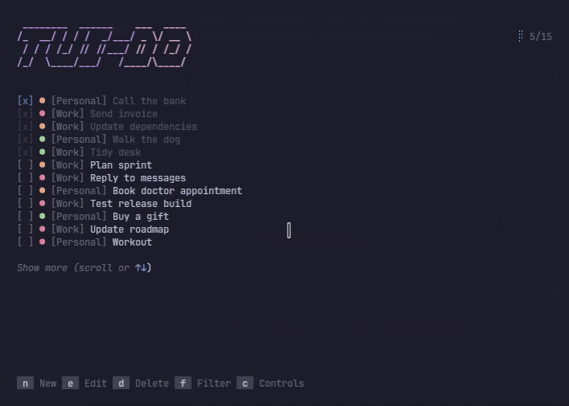
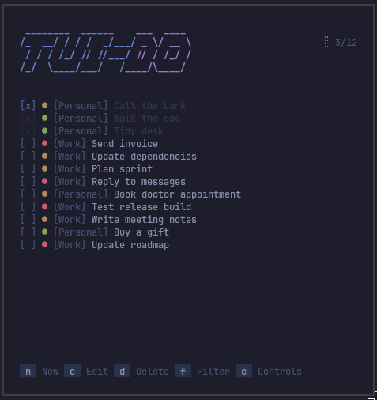
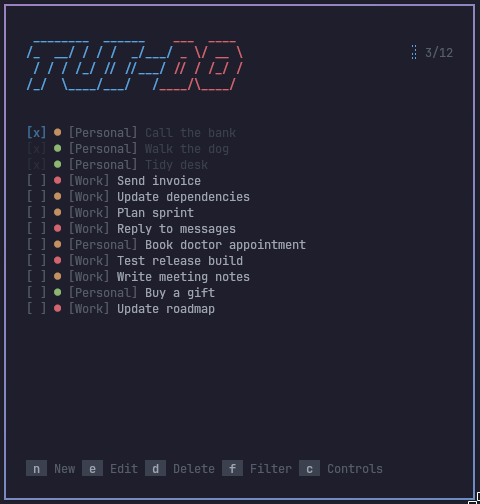
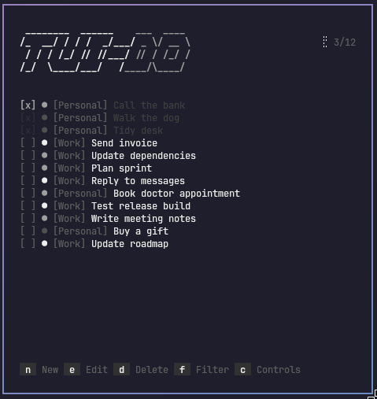
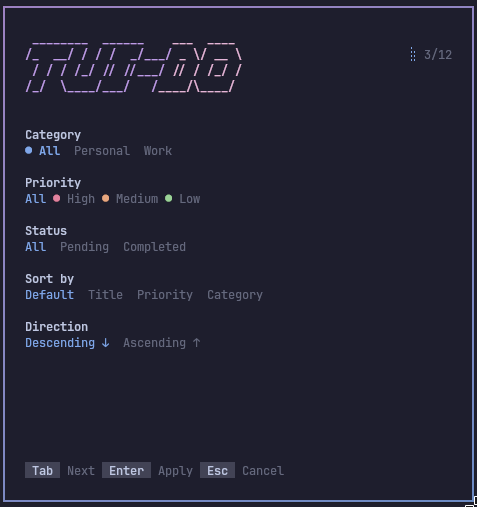
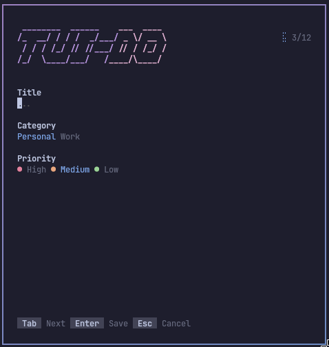
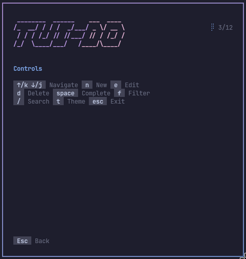

# TUI-DO

**Minimal terminal-first todo manager for tiling WM users.**

[github.com/gsusgit/tuido](https://github.com/gsusgit/tuido)

Built with Go for fast, keyboard-driven workflows — no mouse required.

**TUI** (terminal UI) + **DO** (your to-do list). The banner yells **TUIDO** in slant ASCII; you run **`tuido`** in lowercase — same tradition as `vim`, `git`, and other tools that let the work speak louder than the name.

<p align="center">
  <a href="https://go.dev/"></a>
  <a href="https://github.com/charmbracelet/bubbletea"></a>
  <a href="#installation"></a>
</p>

<p align="center">
  
</p>

---

## Why?

I've always liked having **one simple place** for what's pending — not a productivity suite with hundreds of toggles I'll never use. I just want to see **what I've done** and **what's still left**.

My setup is a Hyprland workspace with the essentials always on screen: music, processes, terminal… and it started to feel like **something was missing** there. Riding the Hyprland / terminal-aesthetic wave, I thought: *let's experiment* — build something **for myself**, that lives in that same tile and stays out of the way.

That's how **TUI-DO** was born: out of a personal need first. If it fits your workflow too, welcome.

---

## Features

- ⌨️ **Keyboard-first** — navigate, create, edit, delete without leaving home row
- 📐 **Responsive TUI** — adapts layout and scroll to your terminal size
- ● **Task priorities** — high / medium / low with color-coded indicators
- 🏷️ **Categories & filters** — status, category, sort in a dedicated panel
- 🔍 **Live search** — filter the list by title with `/`
- 🌍 **Multi-language** — English, Español, Français, Deutsch, Italiano, Português
- 🎨 **Four themes** — Catppuccin Mocha, Tokyo Night, One Dark, Monochrome
- 💾 **Local-first** — JSON on disk under `~/.config/tuido/`, autosave
- 🪶 **Lightweight** — single binary, no daemon, no account
- 🧱 **Tiling-friendly** — made for Hyprland, i3, sway and split terminals

---

## Screenshots

### Task list · themes

<table>
  <tr>
    <td width="25%" align="center" valign="top">
      
      <br /><sub><b>Catppuccin Mocha</b></sub>
    </td>
    <td width="25%" align="center" valign="top">
      
      <br /><sub><b>Tokyo Night</b></sub>
    </td>
    <td width="25%" align="center" valign="top">
      
      <br /><sub><b>One Dark</b></sub>
    </td>
    <td width="25%" align="center" valign="top">
      
      <br /><sub><b>Monochrome</b></sub>
    </td>
  </tr>
</table>

### Views

<table>
  <tr>
    <td width="25%" align="center" valign="top">
      
      <br /><sub><b>Filters</b></sub>
    </td>
    <td width="25%" align="center" valign="top">
      
      <br /><sub><b>Task editor</b></sub>
    </td>
    <td width="25%" align="center" valign="top">
      
      <br /><sub><b>Controls</b></sub>
    </td>
    <td width="25%"></td>
  </tr>
</table>

---

## Installation

```bash
git clone https://github.com/gsusgit/tuido.git
cd tuido
go build -o tuido .
install -Dm755 tuido ~/.local/bin/tuido
tuido
```

Or: `go install github.com/gsusgit/tuido@latest`

Requires **Go 1.26+** and a true-color terminal (min. **60×20**).

```bash
tuido              # run
tuido lang es      # language
tuido reset -f     # wipe tasks
```

---

## Controls

| Key | Action |
|-----|--------|
| `↑` `↓` / `k` `j` | Navigate |
| `n` | New task |
| `e` | Edit |
| `d` | Delete → `Enter` confirm, `Esc` cancel |
| `Space` | Toggle done |
| `f` | Filters |
| `r` | Reset filters (when active) |
| `/` | Search |
| `t` | Cycle theme |
| `c` `?` | Help |
| `Esc` `q` | Quit |

In **filters**: `Tab` / `←` `→` to change options, `Enter` to apply.  
In **new/edit**: `Tab` fields, `←` `→` category/priority, `Enter` save.

---

## Configuration

| Path | Content |
|------|---------|
| `~/.config/tuido/config.json` | `lang`, `theme` |
| `~/.config/tuido/data.json` | tasks |

Themes: `catppuccin` · `tokyo-night` · `one-dark` · `monochrome` — or press `t` in-app.

Languages: `en` · `es` · `fr` · `de` · `it` · `pt`

---

## Non-goals

TUI-DO is **not** a team suite, a cloud SaaS, or a bloated life OS.

Just **speed**, **simplicity**, and **terminal-native** focus.

---

## Built with

[Go](https://go.dev/) · [Bubble Tea](https://github.com/charmbracelet/bubbletea) · [Lip Gloss](https://github.com/charmbracelet/lipgloss) · [Bubbles](https://github.com/charmbracelet/bubbles)

---

<p align="center">
  <sub>Made for people who <code>$</code> live in the terminal.</sub>
</p>
